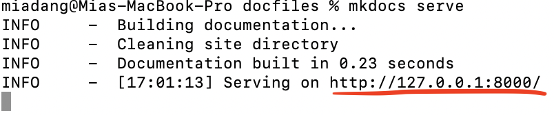
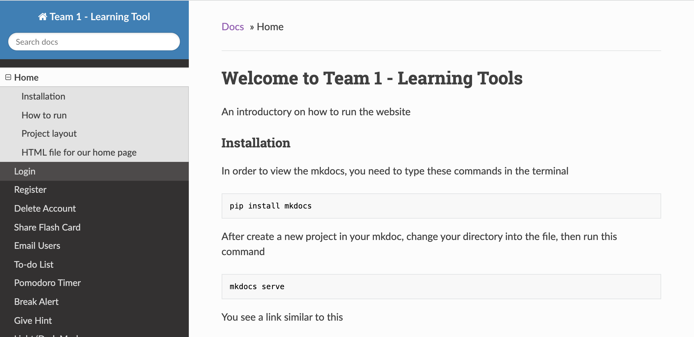
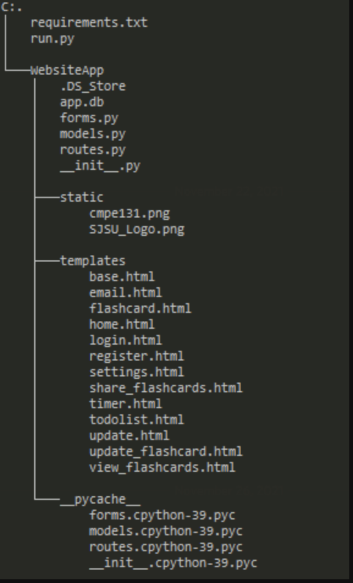

# Welcome to Team 1 - Learning Tools

An introductory on how to run the website

### Installation

In order to view the mkdocs, you need to type these commands in the terminal

```bash
pip install mkdocs
```

After create a new project in your mkdoc, change your directory into the file, then run this command

```bash
mkdocs serve
```

You see a link similar to this



You then can use the link to view our markdown files (below is our home page in mkdocs)


### Other requirement installs

Below is the list that viewers need to install in order to run the website

```bash
brew install python3
```

```bash
pip install flask
```

```bash
pip install Flask-Mail
```

```bash
pip install pyttsx3
```

### How to run

In order to run the file in your terminal, you just simple type

```python
python3 run.py
```

This is run.py file

```python
from WebsiteApp import app_Obj
app_Obj.run(debug=True)
```

Additionally, you also need an **init**.py file to be able run the above command

```python
import os
import flask
from flask_login import LoginManager
from flask_sqlalchemy import SQLAlchemy
from flask_mail import Mail, Message

basedir = os.path.abspath(os.path.dirname(__file__))

app_Obj = flask.Flask(__name__)
app_Obj.config.from_mapping (
    SECRET_KEY = 'it-dont-matter',
    SQLALCHEMY_DATABASE_URI = 'sqlite:///' + os.path.join(basedir, 'app.db'),
    SQLALCHEMY_TRACK_MODIFICATIONS = False
)

db = SQLAlchemy(app_Obj)
login = LoginManager(app_Obj)
login.login_view = 'loginPage'

from WebsiteApp import routes, models

```

### Project layout



### HTML file for our home page

```



<!DOCTYPE html>
<html lang="en">
    <body>
        <div class="container-fluid">
            <h1 style="color: black;" class="text-center">
                Learning Tool - CMPE 131 Project
            </h1>
            <div class="text-center" style="color: black">
                
                <h1>Features</h1>
            </div>
            <div style="margin-top: 15px;color: black">
                <ul class="text-center" style="margin-left: -70px;">
                    <ol> Register/Login Function </ol>
                    <ol> Delete account </ol>
                    <ol> Share Flash Cards </ol>
                    <ol> Email Users </ol>
                    <ol> To-Do-List  </ol>
                    <ol> Timer </ol>
                    <ol> Break Alerts </ol>
                    <ol> Light + Dark Mode </ol>
                </ul>
            </div>
        </div>
    </body>
</html>

```
